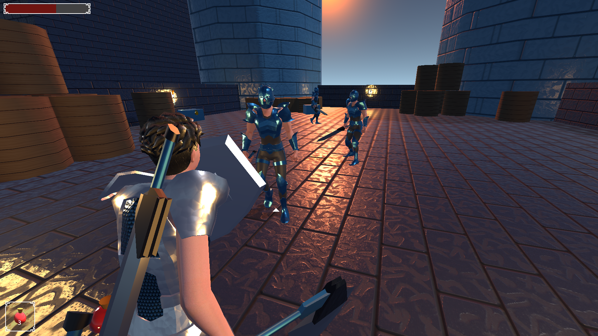
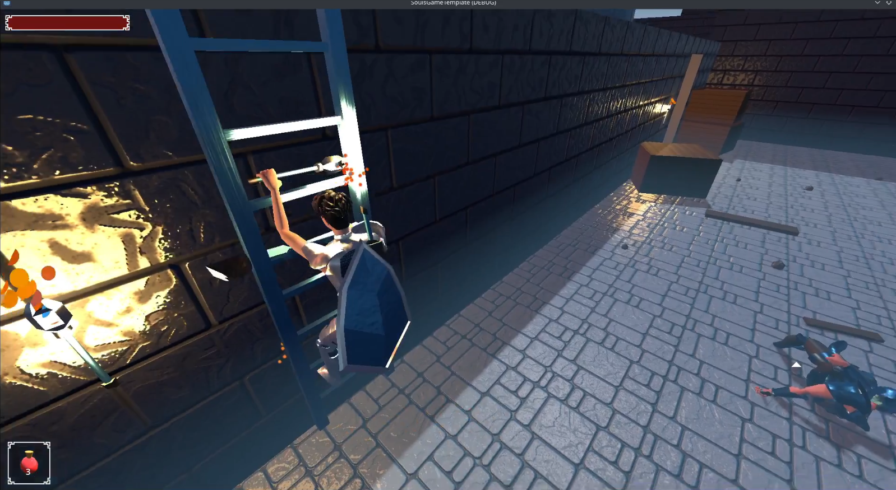
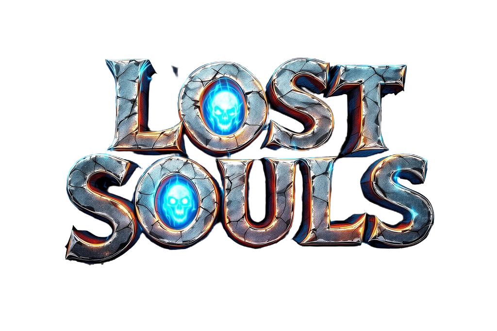
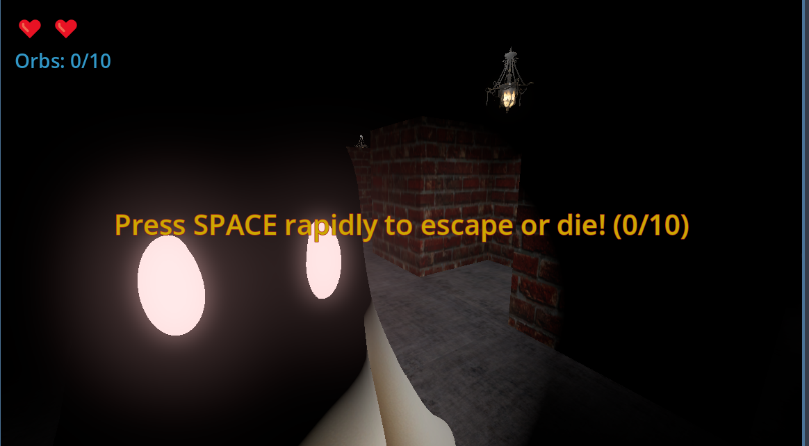
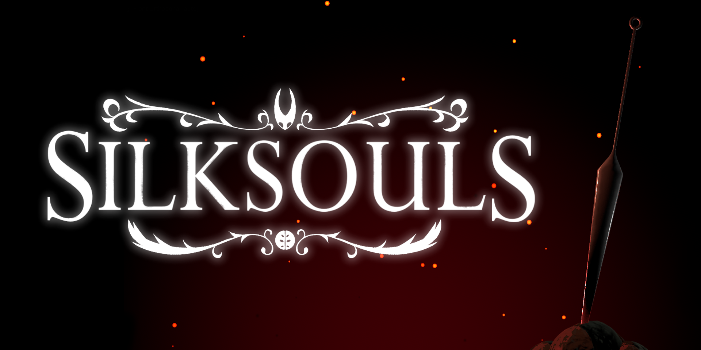
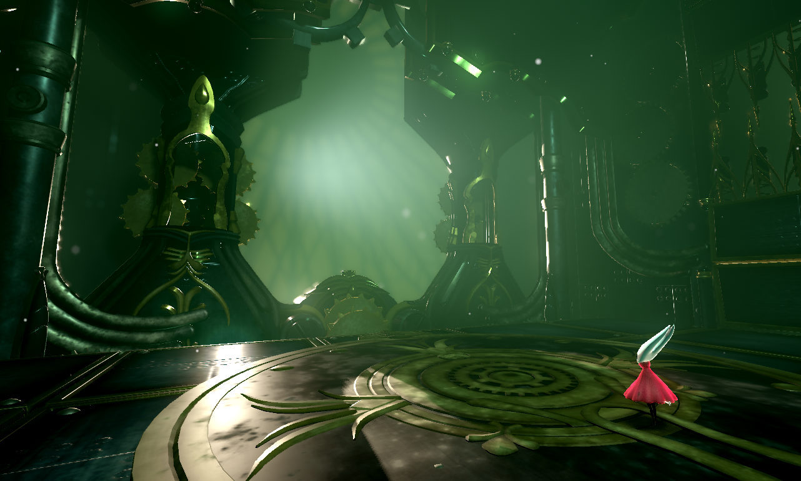
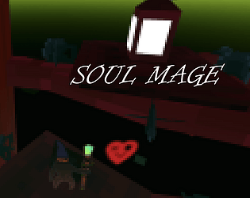
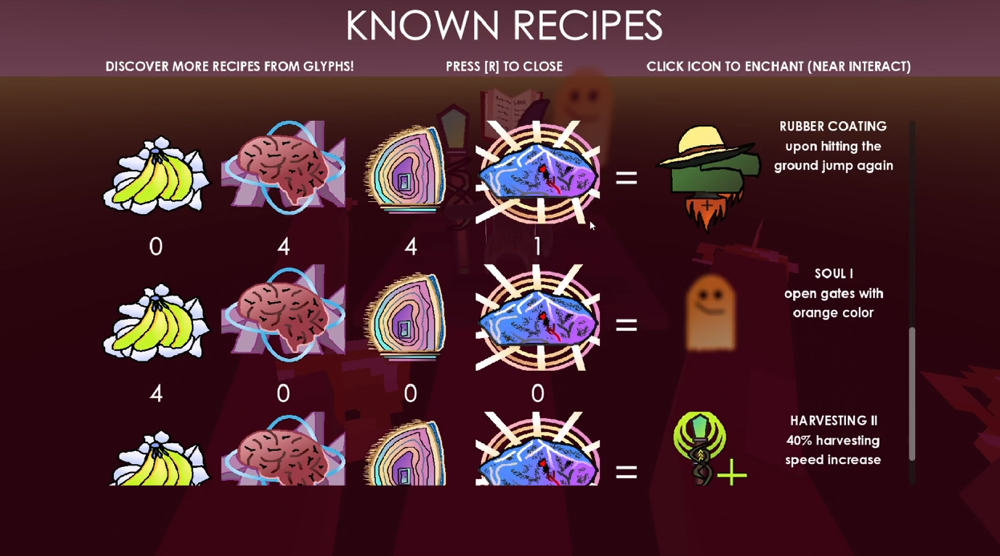

# Заметки по движку и шаблону

Решение по техническому стеку для «1000 Lives» (souls-like).

> **Пометки:** ✅ — предпочтительный вариант · ⚠ в разработке · 🔍 — ещё смотрю

## Резюме

**Godot 4** ✅ — движок по умолчанию. Плюс **Cat's Godot 4 Souls-Like Template** ✅ как стартовая база для боёвки.

Причины:
- Бесплатный, без лицензионных отчислений.
- GDScript простой для старта (опыта с движками нет).
- Visual Shader → динамические визуалы предметов от параметров игрока без написания шейдеров вручную.
- Есть готовый souls-like шаблон с боёвкой, AI и 110+ анимациями.

## Сравнение движков

| Критерий | Godot 4 ✅ | Unity | Unreal 5 |
|----------|-----------|-------|----------|
| Стоимость | Бесплатно | Бесплатно до порога дохода | 5% после $1M |
| Сложность старта | Низкая (GDScript) | Средняя (C#) | Высокая (C++/Blueprints) |
| 3D качество | Хорошее, растёт | Отличное | Топовое |
| Shader для динамических визуалов | Visual Shader | Shader Graph | Material System |
| Готовые souls-like шаблоны | Есть (Cat) | Есть (ассеты) | Есть (сторонние) |
| Вес редактора | Лёгкий | Средний | Тяжёлый |

**Итог:** для инди с нуля без опыта Godot — оптимален. Unreal — overkill, Unity — запасной вариант.

## Проверенные варианты

### 1. Cat's Godot 4 Souls-Like Template ✅

Готовый souls-like каркас — самый близкий к задаче проект.





**Что внутри:**
- Root Motion боёвка (основная + побочная рука)
- Dodge roll, perfect parry, blocking
- Enemy targeting, enemy AI с состояниями и pathfinding
- Ragdoll смерть, consumables, ladder movement
- 110+ анимаций, звуки, музыка
- Совместимость с моделями Mixamo
- Лицензии: CC0 / Unlicense (можно брать свободно)

**Ссылки:** [GitHub](https://github.com/catprisbrey/Cats-Godot4-Modular-Souls-like-Template) · [itch.io](https://felesmachina.itch.io/cats-godot-souls-like-template) · [Godot Asset Library](https://godotengine.org/asset-library/asset/2609)

**⚠ Важно:** автор анонсировал новую версию шаблона (упор на модульность и другие 3rd-person жанры). Старая версия остаётся на GitHub. Автор сам признаёт, что код местами запутанный — стоит брать как референс, а не как фундамент без изменений.

### 2. Gradientfall 🔍

Активный 3D action-adventure вертикальный слайс на Godot 4.7: procedural terrain, third-person контроллер, боевка, динамическое небо.


**Ссылки:** [GitHub](https://github.com/danieltalbert/gradientfall)

**Интересно как:** референс по атмосфере окружения, третьелицевой камере и процедурной генерации.

### 3. Lost Souls 🔍

3D survival maze на Godot 4.11: готическая архитектура, освещение факелами, призраки-враги.





**Ссылки:** [itch.io](https://edimon4884.itch.io/lost-souls) · [GitHub](https://github.com/EdiCM/LostSouls)

**Интересно как:** референс по тёмной готической атмосфере и освещению. Атмосфера отлично подходит под сеттинг «1000 Lives».

### 4. SILKSOULS 🔍

3D фан-игра по Hollow Knight на Godot: боссы Silksong в 3D. Требует RTX 4060 — видно, насколько Godot может быть требователен при высоких настройках.





**Ссылки:** [itch.io](https://grumb000.itch.io/silk-souls)

**Интересно как:** потолок графики Godot 4 в умелых руках.

### 5. Soul Mage 🔍

Souls-like 3D платформер с джема Godot Wild Jam #66. Короткий проект — быстрый обзор возможностей.





**Ссылки:** [itch.io](https://sevadusk.itch.io/soul-mage)

**Интересно как:** миниатюрный souls-like на Godot 4.2 — показывает, что можно сделать быстро. Отзывы указывают на проблемы с камерой — стоит учесть при проектировании камеры.

## Техническая заметка: визуал предметов от параметров

Ключевая фича «1000 Lives» — предметы меняют вид от статов игрока. В Godot это делается через шейдеры:

```
Игрок подбирает/смотрит на предмет →
  скрипт проверяет статы →
  material.set_shader_parameter("blur", 0.3)  # Восприятие < 50
  material.set_shader_parameter("blur", 0.8)  # Восприятие < 20
  material.set_shader_parameter("glow", true) # Интеллект > 200
```

Пример — низкое Восприятие делает очертания предметов размытыми (нужны очки). Делается на **VisualShader** (нодовый редактор) + `set_shader_parameter` из скрипта.

## Открытые вопросы / TODO

- [ ] Попробовать **Cat's Template** — оценить код и запустить демо.
- [ ] Просмотреть новые версии/замену шаблона Cat.
- [ ] Решить 3D-формат: third-person или first-person (для souls-like классика — third-person).
- [ ] Изучить Visual Shader для эффектов размытия/свечения.
- [ ] Оценить бюджет: какие 3D-модели брать (Kenney, Quaternius, Mixamo).
